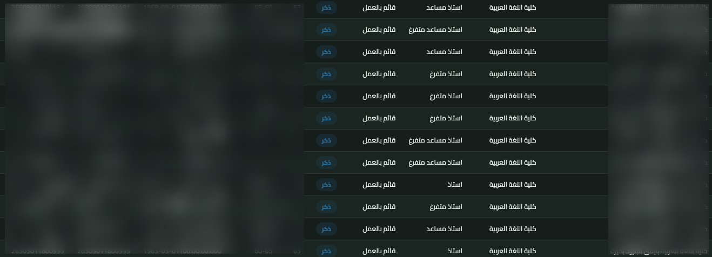
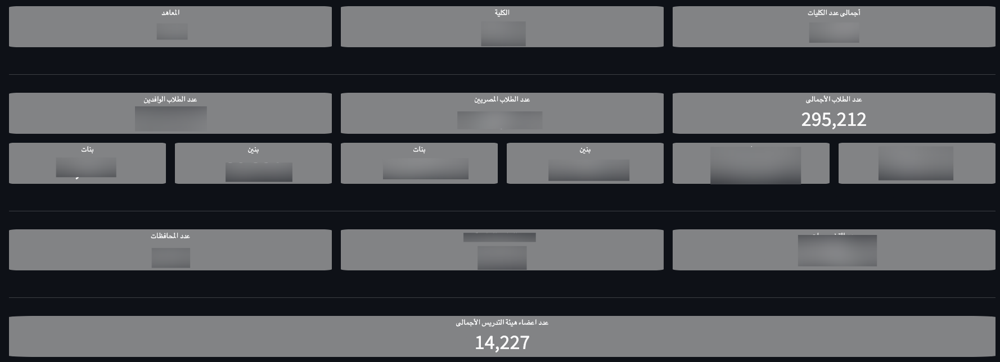
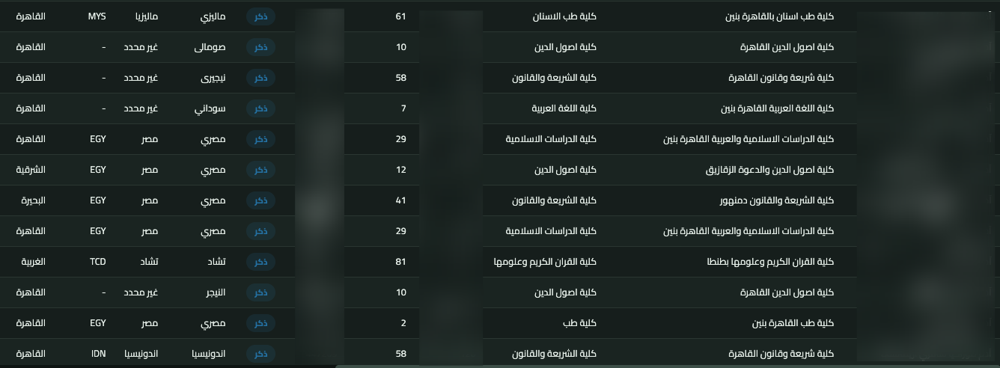

# Unauthenticated Access to Sensitive Academic and Personnel Data

**Severity:** Critical
**Discovery Date:** 2026-08-06
**Status:** Resolved
**Researcher Identity:** Withheld
**Affected Organization:** Al-Azhar University

## Executive Summary

A web-based academic/administrative dashboard belonging to Al-Azhar University was discovered to be accessible without an authenticated session. The exposed functionality provides access to sensitive student and faculty/staff information.

The application also discloses required parameter names when expected parameters are omitted. Supplying the required parameter(s) allows the relevant dashboard functionality to render. This constitutes an authentication/access-control failure that permits unauthenticated access to sensitive data.

## Data Exposed

### Faculty / Staff Information

Observed fields include:

- Full name
- English name
- Faculty
- Faculty group
- Academic/scientific degree
- Employment/job status
- Gender
- Age
- Date of birth
- National ID
- User code
- Email address
- Mobile number
- Sector
- Geographic distribution
- Appointment year
- Last login

### Student Information

Observed fields include:

- Student name
- Faculty
- Faculty code
- Student number
- Gender
- Nationality
- Country code
- Governorate code
- Study method
- Enrollment year
- Record/year information
- Graduation status
- Sector
- Geographic distribution

Fields above are described as observed fields; not every record necessarily contains every field.

## Impact

The affected system contains approximately:

- 295,000 students
- 14,000 faculty/staff members

These figures were confirmed in the dashboard interface.

Unauthenticated exposure of fields such as National ID, email address, mobile number, student number, user code, date of birth, academic information, and employment information creates a critical privacy and security impact. The exposed functionality was also observed to support data download/export; the details of this capability are intentionally not described.

## Reproduction

1. Access the affected dashboard without an authenticated session.
2. No normal login requirement is enforced.
3. Omitting required parameters causes the application to disclose the missing parameter name(s).
4. Supplying the required parameter(s) allows the relevant dashboard functionality to render.
5. Sensitive data fields become accessible.

> The exact target, URL, endpoint, parameters, requests, and extraction procedures are intentionally withheld.

## Evidence

Three screenshots are referenced as evidence demonstrating the exposed data-field structure. No personal records visible in the screenshots are reproduced in this report.

### Evidence 1 — Faculty/staff identity and employment-related fields

### Evidence 2 — General dashboard statistics and complete general information

### Evidence 3 — Student identity and academic-related fields

## Security Classification

- **Vulnerability:** Missing Authentication / Broken Access Control
- **Impact:** Sensitive Personal and Academic Data Exposure
- **Attack Complexity:** Low
- **Privileges Required:** None Observed
- **User Interaction:** None Observed

## Disclosure Note

This public report intentionally excludes exact URLs, parameters, personal records, exported datasets, and bulk-download procedures. The purpose of this repository is to document the security issue and demonstrate the categories of exposed information. The vulnerability has been resolved.
